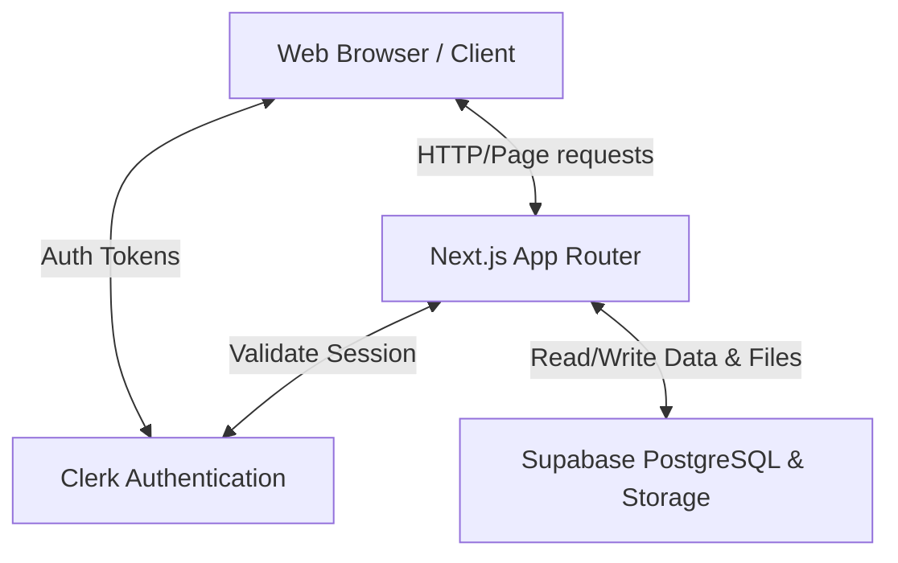

# High-Level Design (HLD) - MiniVouch

## 1. Introduction
MiniVouch is a modern, lightweight testimonial collection and showcase platform. It enables individuals and businesses to collect verified feedback from peers, clients, mentees, and collaborators.

## 2. System Architecture
The platform follows a standard three-tier Next.js architecture:
- **Client (Frontend):** React components built with Next.js (App Router) and TailwindCSS.
- **API (Backend):** Next.js Serverless API routes acting as the BFF (Backend-for-Frontend).
- **Database Backend & Auth:** Supabase (PostgreSQL + Storage) and Clerk (Authentication).

### Architecture Diagram

## 3. Core Components

### 3.1 Frontend (Next.js App)
- **Public Wall (`/`):** Displays approved testimonials. Supports filtering and pagination.
- **Submission Form (`/submit`):** Authenticated users can submit feedback, optionally attaching an image and selecting their visibility (anonymous or public).
- **User Dashboard (`/dashboard`):** Users can manage their feedback, including editing pending testimonials, toggling anonymity, and tracking approval status.
- **Admin Panel (`/admin`):** A protected route for the site owner to approve, reject, or delete submissions.

## 4. UI/UX Principles
- **Flow Consistency:** The testimonial editing process in the dashboard mirrors the submission form flow (Identity -> Message -> Attachment).
- **Consolidated Layouts:** Testimonial cards use a standardized structure across the public Wall and User Dashboard to ensure a consistent experience.

### 3.2 Authentication Layer (Clerk)
- Handles user sign-up, sign-in, and session management.
- Provides Next.js Middleware to protect routes (`/dashboard`, `/submit`, `/admin`).

### 3.3 Data Layer (Supabase)
- **PostgreSQL Database:** Stores user profiles and testimonial data.
- **Storage Buckets:** Stores attached images and user-uploaded avatars.
- **Row Level Security (RLS):** Prevents unauthorized access directly at the database level.

## 4. Design Choices & Trade-offs
- **Next.js Server Components vs Client Components:** We use Server Components by default for SEO and fast initial load (like the public wall), falling back to Client Components where interactivity is required (like the animated hero or forms).
- **Clerk vs Supabase Auth:** Clerk was chosen for its drop-in UI and superior session management in Next.js App Router, while Supabase handles the core data storage.
- **Image Handling:** Images are uploaded directly to Supabase storage via an API route which returns the public URL to be stored in the database row.
